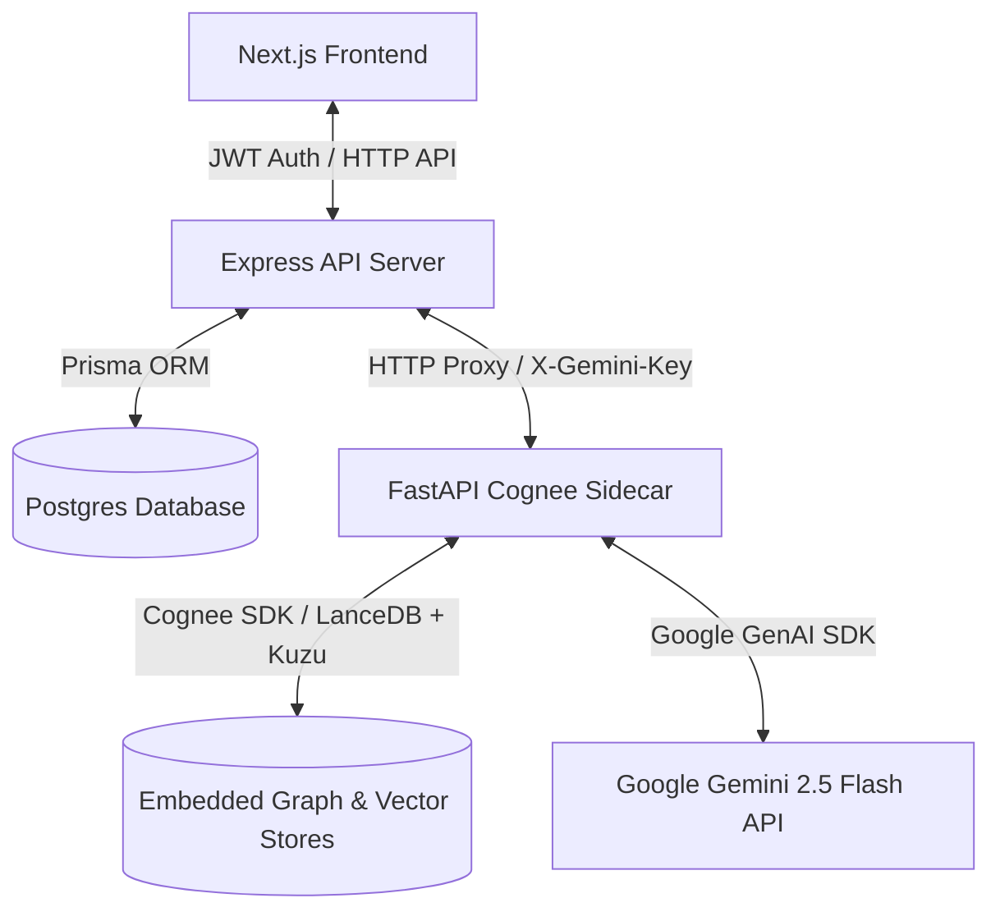

# WeakSpot - Personal Coding-Practice Memory System

WeakSpot is a full-stack web application designed to track and structure pattern-based mistakes in DSA/coding prep using the **Cognee memory library**.

---

## Architecture Diagram



---

## Cognee Lifecycle Mapping

| Cognee Operation | WeakSpot Trigger Event | Action Details |
|---|---|---|
| **`remember()`** | User logs a failed/hint practice attempt | Gemini structures the logic mistake and takeaway; stores it under the pattern dataset namespace. |
| **`recall()`** | User triggers "Check History" before starting a pattern | Recalls matching past failures from Cognee; Gemini compiles a technical watch-out briefing. |
| **`improve()`** | User executes improvement optimizations | Runs Cognee's structural analysis and graph refinement on pattern memory structures. |
| **`forget()`** | User demonstrates pattern mastery (3 consecutive solved attempts) | Surgical deletion of pattern dataset warning nodes in Cognee, resetting recall alerts. |

---

## Auth & Billing Workflows

### Authentication
*   **Sign Up (`POST /auth/signup`)**: Standard email/password validation. Hashed using `bcryptjs`, created in Postgres, returns a JWT.
*   **Login (`POST /auth/login`)**: Validates credentials using `bcrypt.compare`, issues a 24h JWT.
*   *Exclusions*: No email verification, password reset, or refresh tokens are supported.

### Tier & Billing Flow
*   **Free Tier (BYOK)**: Users configure their own Gemini API key via onboarding. Logs are capped at 15 logs/day and 50 active weak spots tracked. Enforced server-side.
*   **Pro Tier (Managed)**: Initiated via `POST /billing/create-order` creating a ₹499 Razorpay order. Upon successful payment verification on `POST /billing/verify` (HMAC sha256 check), the user's tier is updated to `pro`, unlocking unlimited logging and keyless backend execution using `GEMINI_SERVER_KEY`.

---

## Sandbox Demo Script Walkthrough

Follow these steps in the UI dashboard to verify the end-to-end memory lifecycle:

1.  **Register & Setup**:
    *   Create a developer account.
    *   Under **Usage & Billing**, add your Gemini API Key (starts with `AIzaSy`).
2.  **Log a Failure (`remember()`)**:
    *   Log a failed attempt for "Sliding Window" with mistake: *"Slipped on window contraction boundaries, incrementing frequencies too early."*
    *   See the live feed stdout show the `remember()` operation.
3.  **Perform Recall Check (`recall()`)**:
    *   Select "Sliding Window" in the **Pre-Solve Pattern Checker** and click "Check History".
    *   Verify you receive a structured Gemini briefing summary listing your contractive off-by-one warning.
4.  **Demonstrate Mastery (`forget()`)**:
    *   Log 3 consecutive correct `"Solved"` attempts for "Sliding Window" (e.g. Min Window Substring, Longest Substring, etc.).
    *   On the 3rd solved attempt, see the system stdout trigger the `forget()` pipeline for "Sliding Window" to clear warning nodes.
5.  **Re-Check Clean State**:
    *   Search "Sliding Window" again. You will see a green success card: *"No active weak spots... Memory is clean."*

---

## Docker Resource Cleanup

To stay within the 5GB machine disk footprint limitations, run these commands to prune unused containers, builder stages, and image caches:

```bash
# View current disk space occupied by Docker
docker system df

# Prune unused build caches (very important for builder layers)
docker builder prune -f

# Force delete dangling images
docker image prune -f

# Clean up stopped containers and unused networks
docker system prune -f

# Down containers with volume resets
docker compose down -v
```
